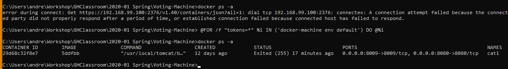

# Notes on Importing and Running the VotingMachine

## Can't Run Directly on Windows or MacOS

Docker uses special Linux operating system calls, and a very interesting sort of file system, to create a special runtime environment for Docker applications.

Because of this, running Docker on Windows or MacOS requires using virtual machine technology.  The cheapest—free and open-source [VirtualBox](https://virtualbox.org)—is also extremely useful and reliable.  VMware and Parallels are excellent commercial virtualization packages, and Windows Hyper-V can also work.

## Docker Desktop may do this all for you

Docker Desktop doesn't do an awful lot for you, but it may make unnecessary some of the following steps:

## Creating a docker machine

I use this command to create a new VirtualBox machine for running Docker.  (For Hyper-V or other virtualization systems, the options will be different.)

`docker-machine create --driver virtualbox --virtualbox-no-vtx-check default`

This creates a VM called `default` which is what is used by the `docker-machine` utility and the `docker` commands use that.

## Configuring to run Docker against the docker machine

The new docker machine is dormant.  To start it, use

`docker-machine start`

When it completes, why does it give you a message like this?


When the docker machine starts, it does not advertise itself or provide any kind of registration.  Because of this, when you issue a regular `docker` command, that command will not know how to work with the docker machine.  It needs an *environment*.  So what is this `docker-machine env`?  It tells you the settings needed for `docker` to talk to the machine.  It does not actually *set* those settings, it tells you what they are.  It also tells you *how* to set them.

### `docker-machine env default` on windows

This is what the output looks like on Windows.

```powershell
SET DOCKER_TLS_VERIFY=1
SET DOCKER_HOST=tcp://192.168.99.100:2376
SET DOCKER_CERT_PATH=C:\Users\adwolfe\.docker\machine\machines\default
SET DOCKER_MACHINE_NAME=default
REM Run this command to configure your shell:
REM 	@FOR /f "tokens=*" %i IN ('docker-machine env default') DO @%i
```

### docker-machine env on MacOS

Here is the output on MacOS:

```bash
export DOCKER_TLS_VERIFY="1"
export DOCKER_HOST="tcp://192.168.99.100:2376"
export DOCKER_CERT_PATH="/Users/adwolfe/.docker/machine/machines/default"
export DOCKER_MACHINE_NAME="default"
# Run this command to configure your shell:
# eval $(docker-machine env default)
```

### What Setting the Environment does:

...on MacOS, you check whether you're up using `docker ps -a`. Before running that `eval` command, you get an error.  Afterwards, you're good:


Similarly, on Windows:



## Preparing to Import

First, start the docker machine if needed:

`docker-machine start`

### Open Ports on virtualbox (Possibly not needed)

need to open 8080 and 8009 on virtualbox.  Open the VirtualBox Manager and select the Settings on the `default` virtual machine.

Switch to Network and open the first network interface ("NAT")

Click on "port forwarding"

Click the "plus" icon at upper right and enter name tomcat-main, port 8080 to port 8080

Click the "plus" icon again and enter name tomcat-control, port 8009 to port 8009

### Where's the Container file?

The container is on the class google drive "Student resources".  It's called `cat1-Phase0-container.tar`.

### Import the container

You can pick up the container from wherever you downloaded it.  Be sure to give any necessary path before the name.

`docker import /Users/adwolfe/Downloads/cat1-Phase0-container.tar`

This import will succeed, blurting out a long hashcode ID.  This ID is an (unnamed) image.  Find it with 

`docker images`

```bash
$ docker images
REPOSITORY          TAG                 IMAGE ID            CREATED             SIZE
<none>              <none>              5ddfbb25089c        20 minutes ago      1GB
hello-world         latest              fce289e99eb9        12 months ago       1.84kB

```

Here the ID is `5ddfbb25089c`. Get your hash/ID and use it to start the image:

`docker run --name cat1 -d -p 8080:8080 -p 8009:8009 5ddfbb /usr/local/tomcat/bin/catalina.sh run`

Here I am using the name `cat1` again, but that doesn't matter.  Note in the middle of the command is the hashcode. Docker will allow you to give just a hashcode prefix rather than typing out the full ID.

### Check the Container

Issuing the command `docker ps` should show your new "cat1" container running.  Here is a Windows screen showing the `docker run` and then running `docker ps` twice.


### Test the Container

Open your browser and browse to [http://localhost:8080](http://localhost:8080).  This is where the mysterious failures occur. However, you should see a "Tomcat" home page. If you like, you can go to the "Manager." The username is `cosca451` and the password is the same `cosca451`.

It then "List Applications," and click on "Voting."How I Exported the "Phase0" Container... 1 gb

My container is named `cat1`; the name is immaterial.  Its ID is `948ac554455fa`.  I did an export from the container...

`docker export 948ac554455fa -o cat1-Phase0-container.tar`